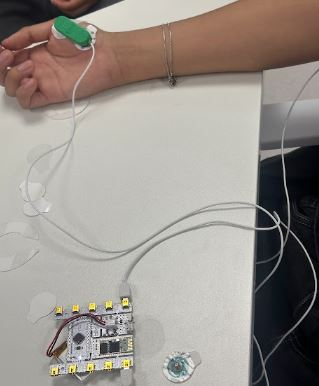
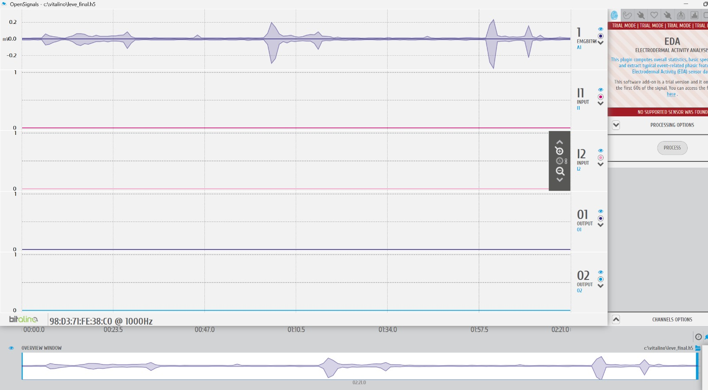
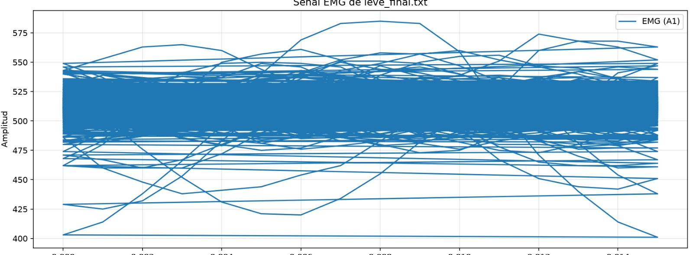

# Informe Laboratorio 3

# Colocación de electrodos y uso del bitalino
Siguiendo las consideraciones dadas en clase y la guía, se colocaron los electrodos correspondientes a los músculos bíceps y a la referencia. Se tomó en cuenta evitar la cercanía.
de elementos tecnológicos al bitalino y se realizó la conexión bluetooth.

https://github.com/user-attachments/assets/0f618c11-f033-4a4a-a5d2-570be276c885

https://github.com/user-attachments/assets/8cc60c2e-51a7-45ab-990c-25ef6b946ece

Zona del brazo:

Zona del pulgar:

## Fase A: Reposo
Lectura basal del brazo:

https://github.com/user-attachments/assets/78462e5f-efaf-47ea-881c-30e8d9bc6178

## Fase B: Movimiento leve
Se realizaron 3 repeticiones, con descansos de 1 minutos entre intentos.

Zona del brazo:
https://github.com/user-attachments/assets/66a6dc9c-8a4b-4e5c-a32d-f5707b22ac4e

https://github.com/user-attachments/assets/f3cae1ef-69ab-4a6b-b1f5-a429ea5cc25c

Zona del pulgar:

<video src="./MovimientoLeve.mov" controls width="100%"></video>

## Fase C: Movimiento contra fuerza contraria
Se realizaron 3 repeticiones, con descansos de 1 minutos entre intentos.

Zona del brazo:
https://github.com/user-attachments/assets/0dcb52dc-3dc3-4d97-a9f6-60fef73931de

https://github.com/user-attachments/assets/a7f4cc48-0651-4ef4-9971-381ef5968cfc

https://github.com/user-attachments/assets/97592175-4d76-4c1f-92ac-e6f5990b5688

Zona del pulgar:

<video src="./Movimientofuerte.mov" controls width="100%"></video>

## Señal amplitud vs tiempo
Ploteo en OpenSignals

Ploteo en Python (brazo):

Ploteo en Python (pulgar):

## Explicación de la señal 

La señal EMG ploteada en el Canal 1 a una frecuencia de 1000 Hz representa la actividad eléctrica generada por un movimiento leve de contracción muscular. Como se puede observar las zonas cercanas a 0mV indica un estado basal de reposo y como se mencionó anteriormente las señales cercanas a la amplitud de 0.2 mV y -0.2 mV indica la contracción muscular a un leve movimiento. Como se observa, la señal a la amplitud de +- 0.2 mV se realizó en 3 intentos con un descansos entre intentos de 30 segundos a 1 minuto. La señal es generada por la suma de potenciales de acción de las fibras muscular debido a la despolarización, es decir la activación de las mencionadas. 

Para el análisis se utilizó la señal EMG de la zona del brazo, pese a que se realizó igualmente la zona del dedo pulgar, en el ploteo de Python no se puede analizar correctamente la señal. 

## Quizz

Q1. Which are the significant frequencies for EMG acquisitions? Are they the same in all body areas such as facial
area? 
Para las adquisiciones de EMG, la parte relevante de la señal se encuentra entre 20 y 500 Hz. Sin embargo, este rango no es exactamente igual en todas las zonas del cuerpo, ya que puede variar según el tamaño del músculo y el grosor del tejido. En el área facial, por ejemplo, los músculos son más pequeños y el registro de la señal puede verse afectado por artefactos y movimientos oculares, por lo que la distribución de frecuencias puede ser diferente.

Q2. Which kind of filter is essential when working with EMG signals? Why do we need to apply such a filter?
Un filtro pasa banda, porque la señal relevante se encuentra en un rango de 20 a 500 Hz. Es necesario aplicar este tipo de filtro porque permite eliminar las bajas frecuencias causadas por artefactos y por el movimiento de los electrodos, así como las altas frecuencias producidas por el ruido eléctrico, mientras preserva las partes importantes de la señal.

Q3. How does the amplitude differ in each muscular contraction? Is there a difference for body locations?
La amplitud tiende a aumentar con la intensidad de la contracción muscular. Una contracción débil produce una señal de baja amplitud, mientras que, durante la relajación, la señal se encuentra cerca de la línea base. Esta amplitud puede variar según la zona del cuerpo, ya que los músculos tienen diferentes características y pueden producir señales más fuertes o más débiles.

Q4. Show a screenshot of a relevant portion of Electromyography (EMG) data within the experiment proposed on
Section D of a facial muscle of interest. Does this signal correspond to what you expected? Why? Which
emotion and action did you perform to trigger the muscle? Which muscle did you trigger?
En nuestro caso, en lugar de utilizar un músculo facial, trabajamos con el músculo oponente del pulgar. Para activarlo realizamos movimientos repetidos del pulgar hacia arriba y hacia abajo mientras registrábamos la señal EMG. La señal obtenida muestra variaciones alrededor de la línea base mostrando la activación muscular durante el movimiento, esto corresponde con lo que esperábamos. La amplitud registrada fue relativamente baja, esto puede deberse a que el movimiento del pulgar requiere una contracción menor comparado con músculos más grandes.

Q5. To the best of your knowledge, does the EMG amplitude equal to the amount of force that you have generated
with your muscle?
La amplitud de la señal EMG no equivale directamente a la fuerza que generamos con el músculo. Cuando aumenta la activación muscular también suele aumentar la amplitud del EMG debido al uso de más unidades motoras, pero esta relación no es necesariamente lineal. Una mayor amplitud EMG indica mayor actividad eléctrica muscular, pero no nos dice directamente la fuerza producida.

