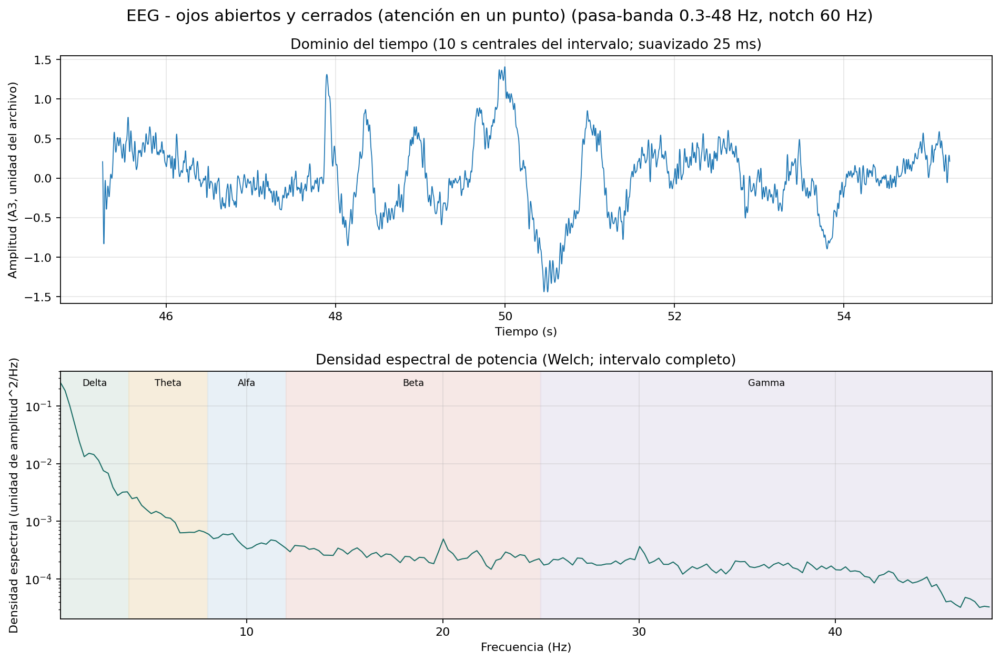
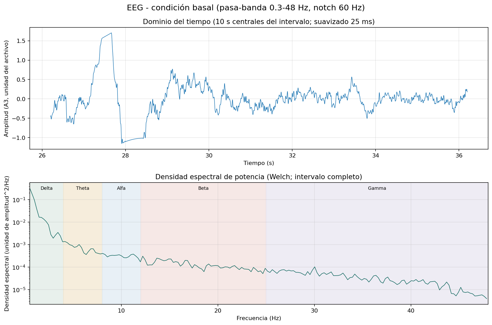
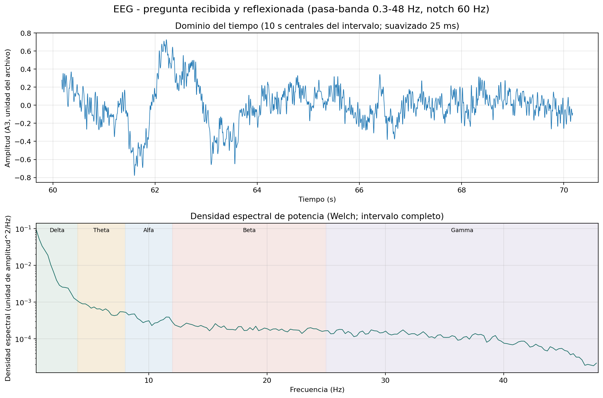
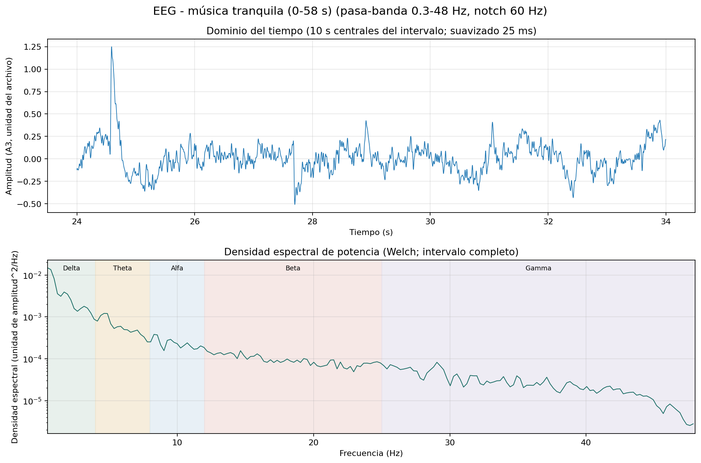
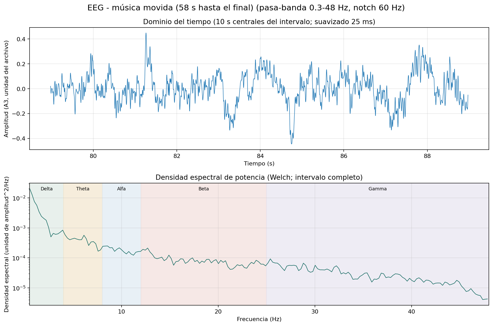

# Informe Laboratorio 6

En el Laboratorio 6 se midió la señal electroencefalograma (EEG), en este markdown se va a realizar el análisis de una persona pese a que
se utilizó en dos el bitalino para señales EEG.
# Ubicación de electrodos y uso del bitalino

Se uso el siguiente Bitalino especificado para señal EEG:
- Uso del Bitalino:

Se ubicaron los electrodos FP1 y FP2  de la siguiente manera y se conectó el Bitalino en el canal 2 y 3 respectivamente para graficar las
señales ECG. Además, se utilizaron materiales extra como audífonos de cable (que se utilizaron como tapones para la lectura basal) y un antifaz utilizado para la lectura basal. 
- Ubicación de Electrodos (Guía de Referencia):

  

  
  
- Ubicación de Electrodos:

     

El electrodo de referencia se colocó en el canal 1, detrás de la oreja como indica la guía. 

Pese a que se conectaron los cuatro electrodos, dos de ellos para FP1 y los otros para FP2 respectivamente, se graficó la señal EEG de los electrodos FP1 en el canal 2 puesto que se visualizó una señal más adecuada para su análisis. 

# Vídeo de las señales obtenidas 
- Lectura Basal (Primera Persona): Para la lectura basal se utilizó el antifaz y los audífonos como tapones para entrar a un estado de descanso.

https://github.com/user-attachments/assets/4fbc1025-249f-4242-a293-96f558102508

- Lectura Basal (Segunda Persona): Iguales indicaciones de uso de materiales extra. En este caso nuestro compañero se encontraba en un estado de somnolencia.

https://github.com/user-attachments/assets/63b20908-40f7-4d08-8c67-64232904f03a

- Inicio de Ciclo de Apertura y Cierre de Ojos (Primera Persona): Para este ejercicio se quitó el antifaz más no los audífonos, así nuestra compañera se concentraría en un único punto. 

https://github.com/user-attachments/assets/1d0423ff-bf51-476f-90ab-74eab967f893

- Inicio de Ciclo de Apertura y Cierre de Ojos (Segunda Persona): Igualmente que la primera persona, sin ninguna diferencia de estado de concentración. 

  
https://github.com/user-attachments/assets/4d345093-717d-422a-bd1e-8d3a694d7367

  
- Susurrar 5 Preguntas Complejas (Primera Persona): Para realizar las 5 preguntas complejas se quitó un audífono, nuestra compañera se encontraba en un estado de resolución de problemas.

https://github.com/user-attachments/assets/afb73c20-d998-48e9-b14d-413012cea5e1

- Escuchar Música (Primera Persona)

https://github.com/user-attachments/assets/373bb685-8fb7-4561-acad-4bd52af4b902

- Escuchar Música (Segunda Persona)

https://github.com/user-attachments/assets/84aead63-fb3d-46f2-8396-02938b7609a4

# Imágenes de la señal ploteada en Open Signals (Segunda Persona)

- Lectura Basal
   

- Inicio de Ciclo de Apertura y Cierre de Ojos
- Susurrar 5 Preguntas Complejas
- Escuchar Música:
  - Loffi Theme
  - Hard Metal

# Ploteo de la señal en Python (Segunda Persona) en el dominio del tiempo y en el dominio de frecuencias

- Lectura Basal
- 

- Inicio de Ciclo de Apertura y Cierre de Ojos
  

- Susurrar 5 Preguntas Complejas

- Escuchar Música:
  - Loffi Theme:
    
    
    
  - Hard Metal:
    
    
  

# Análisis de la gráfica de las señales ploteadas (Segunda Persona)

Para realizar el análisis adecuadamente se utilizará la definición, ejemplos y frecuencias del tipo de ondas identificadas:

#### 3.2. Análisis espectral de las pruebas experimentales

- **Lectura Basal y Ciclo Ocular (Apertura/Cierre):**  
  * **Dominio temporal:** Fluctuaciones lentas de gran amplitud ($-1.5$ a $1.5$ u) vinculadas al parpadeo y la acomodación visual.  
  * **PSD:** Concentración dominante en **Delta** ($< 4\text{ Hz}$, $> 10^{-2}\text{ u}^2/\text{Hz}$). En condición basal se aprecian componentes estables en **Alfa** ($8 - 12\text{ Hz}$)[cite: 3], los cuales sufren atenuación (bloqueo alfa) y redistribuyen su potencia hacia **Beta** al mantener la vista fija.

- **Preguntas Complejas (Carga Cognitiva):**  
  * **Dominio temporal:** Señal más compacta y homogénea ($-0.8$ a $0.7$ u) dominada por oscilaciones rápidas continuas.  
  * **PSD:** Se observa una supresión evidente del ritmo **Alfa** por desincronización cortical y un sostenimiento de potencia en la banda **Beta** ($12 - 25\text{ Hz}$ en torno a $2 \times 10^{-4}\text{ u}^2/\text{Hz}$), reflejando concentración y procesamiento mental activo.

- **Música Tranquila (Lofi Theme):**  
  * **Dominio temporal:** Trazo estable centrado en $\pm 0.5$ u tras un pico inicial transitorio.  
  * **PSD:** Incremento relativo y sostenido en **Theta** ($4 - 8\text{ Hz}$, $\sim 10^{-3}\text{ u}^2/\text{Hz}$)[cite: 5], característico de estados de calma y relajación pasiva, con una curvatura de **Alfa** mejor conservada respecto a la tarea cognitiva.

- **Música Movida (Hard Metal):**  
  * **Dominio temporal:** Oscilaciones de alta frecuencia densas y continuas acotadas en $\pm 0.4$ u.  
  * **PSD:** Mayor contribución de energía en **Beta alta** y **Gamma** ($> 20\text{ Hz}$) frente a la música tranquila[cite: 5, 6], evidenciando incremento en la alerta cortical y la posible presencia de micro-artefactos musculares (EMG) inducidos por el estímulo auditivo.

# Respuestas del Quizz

Q1. Which are the significant frequencies for EEG acquisitions? Are they the same in all brain areas?

Las bandas de frecuencia principales del EEG son delta (0–4 Hz), theta (4–8 Hz), alfa (8–12 Hz), beta (12–25 Hz) y gamma (por encima de 25 Hz). Estas no son necesariamente iguales en todas las áreas cerebrales, la actividad registrada variará según la ubicación de los electrodos y la tarea a realizar. 

Q2. Which kind of filter is essential when working with EEG signals? Why do we need to apply such a filter?

Cuando trabajamos con señales EEG es importante utilizar un filtro pasa-banda; ya que este conserva las frecuencias de interés y reduce los cambios muy lentos de la línea base y el ruido de frecuencias muy altas. Cabe resaltar que el BITalino ya aplica un filtro pasa-banda de aproximadamente 0,8–48 Hz. 

Q3. Can you influence the EEG signal by your thoughts? What action can you do to trigger one frequency band of
choice? Were you able to visualize the change in the signal?

Sí, una tarea mental o visual puede influir en la actividad EEG, pero no podemos elegir y reproducir de manera exacta una frecuencia deseada. Por ejemplo, relajarse mucho puede aumentar la actividad alfa y realizar cálculos mentales puede activar actividad relacionada con la beta. Nosotros pudimos observar cambios en la forma de onda, pero las gráficas no confirman claramente un cambio en una banda específica. También, algunos cambios grandes podrían deberse a movimientos de los ojos, tensión de los músculos faciales o movimiento de los electrodos.

Q4. Show a screenshot of a relevant portion of EEG data within the experiment proposed. Does this signal
correspond to what you expected? Why?

En este experimento, las señales obtenidas corresponden a lo que se esperaba. Durante la música tranquila, la señal estuvo más tiempo en un intervalo corto de 0.6 de amplitud, con un pico y una caída. La música fuerte se mantuvo en un intervalo entre -0.45 y 0.45, y se pueden observar fluctuaciones más frecuentes y sostenidas a los largo del intervalo. Antes del experimento, esperabamos que la música movida, al ser un estímulo auditivo más dinámico y fuerte, produjera mayores variaciones en la actividad EEG que la música tranquila, como se evidencia en el dominio temporal. Además, es posible que los picos aislados durante la música tranquila sean producto de artefactos. Sin embargo, en el dominio frecuencial, ambos casos del experimento presentan una distribución similar con una potencia mayor en las frecuencias bajas. 

Q5. Is there any difference in the signal between the two locations FP1 and FP2?

Según el sistema internacional 10-20, FP1 corresponde a la región prefrontal izquierda y FP2 a la derecha. Esto indica que ambos electrodos registran la actividad EEG desde distintas posiciones, lo cual hace que la señal tenga ciertas variaciones. Estudios previos han analizado la diferencia entre FP1 y FP2 mediante medidas de asimetría prefrontal. Un estudio publicado en British Journal of Anaesthesia midió por separado la potencia de la banda alfa en FP1 y FP2 para cuantificar la asimetría frontal, demostrando que estos dos canales pueden presentar diferencias en su potencia espectral [1]. Aunque ambas pueden presentar patrones similares, no son iguales.

Q6. Which frequencies are supposed to change in the given tasks? Can you see the specific changes in the RAW
signal? Describe what you see.

Sí. Por ejemplo, al cerrar los ojos, se espera que aumente la frecuencia alfa (8–12 Hz); al abrirlos, esta debería disminuir. Las preguntas o cálculos mentales pueden afectar la banda beta (12–25 Hz). 

Q7. To the best of your knowledge, does the EEG amplitude equal to the level of focus you have applied?

No. La amplitud del EEG no mide directamente la concentración. También puede verse afectada por la ubicación y el contacto de los electrodos, los movimientos de los ojos, la tensión muscular y otros artefactos del registro.

[1] Bae J, Lee JS, Oh J, Han DW, Jung H, Kim SM, et al. Association between preoperative frontal electroencephalogram alpha asymmetry and postoperative quality of recovery: an observational study. Br J Anaesth. 2023;130(4):430-438. doi:10.1016/j.bja.2022.12.003.
